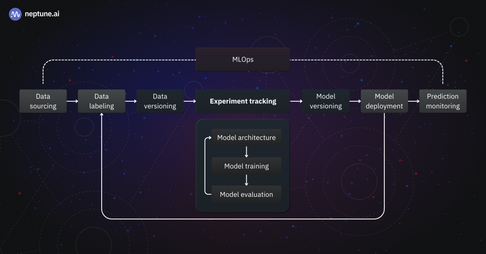

# MLOps Project (Cat Breed Classification)

This MLOps project focuses on developing and deploying a machine learning model for classifying different breeds of cats from images. The project was undertaken as part of learning MLOps principles and practices, with the additional goal of preparing a presentation on MLOps for the final Google Summer of Code (GSoC) meet.

## What is MLOps?

MLOps refers to the practice and discipline within machine learning that aims to unify and streamline the machine learning system development (Dev) and machine learning system operation (Ops). It involves collaboration between data scientists, ML engineers, and IT professionals to automate and optimize the end-to-end lifecycle of machine learning applications.

## File structure

    ├── .dvc                 # DVC (Data Version Control) related files and directories
    ├── artifacts            # Directory to store output artifacts like trained models, logs, etc.
    ├── assets               # Folder for images
    ├── config               # Configuration files for the project
    ├── logs                 # Log files generated during the project execution
    ├── mlruns               # Directory for MLflow runs
    ├── notebook             # Jupyter notebooks for experimentation and analysis
        ├── Cat_classification.ipynb  
    ├── src                  # Source code directory
        ├── cnnClassifier     # Main module for the image classification project
            ├── components    
                ├── __init__.py               # Initializes the components module
                ├── data_ingestion.py         # Handles the ingestion of data from various sources
                ├── data_transformation.py    # Manages the transformation and preprocessing of data
                ├── evaluation.py             # Evaluates the performance of the trained model
                ├── model_trainer.py          # Contains logic for training the model
            ├── constants     # Stores constants used across the project
                ├── __init__.py               # Initializes the constants module
            ├── pipeline      # Defines the end-to-end pipeline stages for the MLOps project
                ├── __init__.py               # Initializes the pipeline module
                ├── prediction.py             # Handles the prediction stage of the pipeline
                ├── stage_01_data_ingestion_pipeline.py   # Implements the data ingestion stage of the pipeline
                ├── stage_02_train_pipeline.py            # Handles the training stage of the pipeline
                ├── stage_03_evaluation_pipeline.py       # Manages the evaluation stage of the pipeline
            ├── utils         # Utility functions and helpers used throughout the project
                ├── __init__.py               # Initializes the utils module
                ├── common.py                 # Contains common utility functions shared across different modules
        ├── __init__.py       # Initializes the src module
    ├── templates             # Contains templates used in the project
    ├── .dvcignore            # Specifies files and directories for DVC to ignore
    ├── .gitignore            # Specifies files and directories for Git to ignore
    ├── app.py                # Main application file
    ├── classes.pkl           # Serialized classes for the model
    ├── dvc.lock              # DVC lock file to track the exact version of data used
    ├── dvc.yaml              # DVC pipeline configuration file
    ├── LICENSE               # MIT license
    ├── main.py               # Entry point for running the project
    ├── params.yaml           # Parameters for the machine learning model
    ├── README.md             # Project readme file
    ├── requirements.txt      # List of dependencies for the project
    ├── scores.json           # JSON file storing evaluation scores
    ├── setup.py              # Script for setting up the project package
    ├── template.py           # Python file for automatically creating the folder structure

## MLOps Project Lifecycle



## Tools used

1. Data source - Kaggle
2. Data transformation - Keras ImageDataGenerator
3. Data versioning and pipelines - DVC
4. Experiment Tracking - MLFlow
5. Deployment - Docker and Amazon AWS

## How to run?

### Steps:

1. Clone the repository
```
git clone git@github.com:Om-Doiphode/MLOps_Project.git
```

2. Create a conda environment after opening the repository
```
conda create -n mlops_project python=3.8 -y
conda activate mlops_project
```

3. Install the requirements
```
pip install -r requirements.txt

# Finally run the following command
python app.py
```

4. Setup DVC 

```
dvc init
# Reproduce the artifacts
dvc repro 
```

Refer this [tutorial](https://dvc.org/doc/use-cases/versioning-data-and-models/tutorial) for DVC

5. Setup MLFlow

Run this to export as env variables:

```
export MLFLOW_TRACKING_URI = <dagshub-uri>

export MLFLOW_TRACKING_USERNAME = <dagshub_username> 

export MLFLOW_TRACKING_PASSWORD = <mlflow_password>
```

Refer this [tutorial](https://mlflow.org/docs/latest/tutorials-and-examples/index.html) for MLFlow

## GSoC Presentation

https://www.canva.com/design/DAGNQ4vFQlM/i5DB72zLwHb9I12ynrTC_w/view
